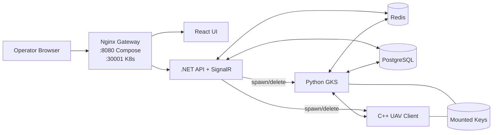
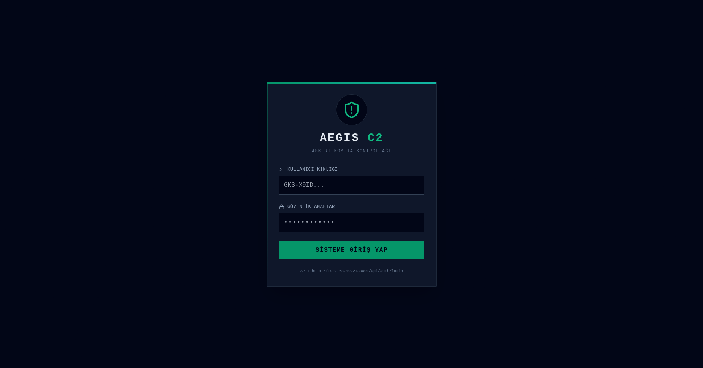
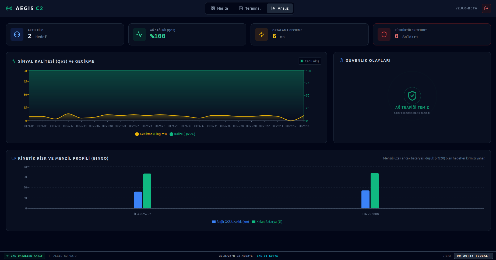
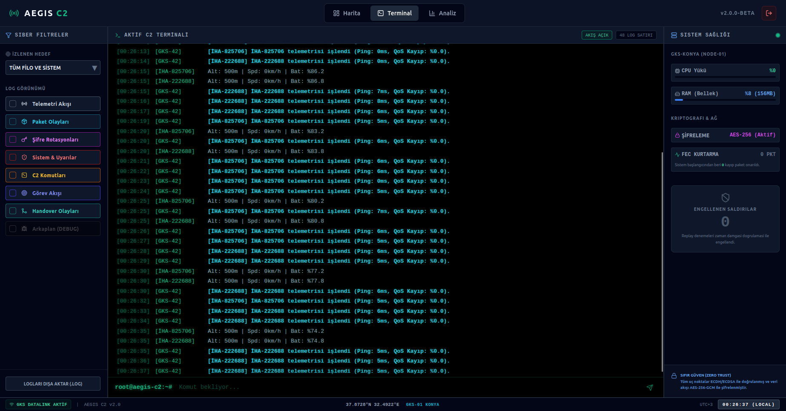
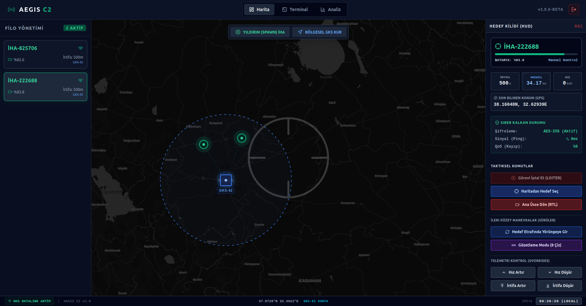

# Aegis C2

Aegis C2 is an open-source UAV Command and Control simulation platform built to demonstrate secure, real-time, multi-node operations across a modern cloud-native stack.

It combines a `.NET 8` control API, a `Python` ground station server, a `C++` UAV client, and a `React` operator interface into one cohesive system.

## Why Aegis C2 Is Portfolio-Strong

- End-to-end multi-stack architecture (`C#`, `Python`, `C++`, `React`) in a single product.
- Real-time operational flow through `SignalR`, `Redis pub/sub`, and UDP telemetry channels.
- Security-oriented baseline with JWT auth, role checks, validation, rate limiting, and secret hygiene.
- Dynamic orchestration paths for deployment lifecycle actions (spawn, delete, handover, radius updates).
- Built-in event model for both live monitoring and historical analysis.

## Product Overview

Aegis C2 simulates how an operator supervises UAV assets through:

- live telemetry streams
- tactical command dispatch
- mission waypoint uploads
- ground station (GKS) lifecycle management
- operational event visibility and system health monitoring

This repository is intentionally designed as a systems portfolio project: architecture depth, deployment maturity, and operational clarity over toy-scale examples.

## Core Capabilities

- Secure login and role-gated control plane.
- Real-time dashboard and command terminal.
- UAV and GKS orchestration endpoints.
- Geofence-aware spawn and handover logic.
- Operational events (`ops_event_stream`, `ops_event_history`) for traceability.
- Dual deployment models:
  - Docker Compose for fast local bring-up.
  - Helm/Minikube for Kubernetes-oriented flow.

## Architecture Diagram



## Repository Layout

- `Aegis_API`: REST API, auth, SignalR hub, orchestration, event services
- `GKS_Server`: UDP ground-control service, crypto/session logic, Redis/DB integration
- `UAV_Client`: C++ telemetry and tactical command client
- `aegis-ui`: operator-facing React interface
- `nginx`: gateway and reverse-proxy configuration
- `helm/aegis`: Helm chart for Kubernetes deployment
- `start_k8s.sh` / `stop_k8s.sh`: Minikube lifecycle helpers

## Quick Start (Docker Compose)

### Prerequisites

- Docker + Docker Compose
- Python 3

### 1. Create local environment file

```bash
cp .env.example .env
```

Fill `.env` with strong local values.

### 2. Generate local crypto keys

```bash
python3 generate_keys.py
```

### 3. Start the platform

```bash
docker compose up --build -d
```

### 4. Open the UI

- `http://localhost:8080`

### 5. Smoke check login endpoint

```bash
curl -fsS http://localhost:8080/api/auth/login \
  -H "Content-Type: application/json" \
  -d '{"username":"<AUTH_USERNAME>","password":"<AUTH_PASSWORD>"}'
```

## Kubernetes Path (Minikube + Helm)

### Start

```bash
chmod +x start_k8s.sh
./start_k8s.sh
```

### Stop

```bash
chmod +x stop_k8s.sh
./stop_k8s.sh
```

`start_k8s.sh` prints dynamic Minikube URLs for UI and API gateway.

## API Endpoints

All endpoints except root health and login require a JWT Bearer token with `Commander` role.

| Method | Route | Auth | Description |
|---|---|---|---|
| `GET` | `/` | No | API liveness |
| `POST` | `/api/auth/login` | No | Returns JWT token |
| `POST` | `/api/deployment/spawn-gks` | Yes | Spawn GKS at `{ lat, lon }` |
| `POST` | `/api/deployment/spawn-uav` | Yes | Spawn UAV at `{ lat, lon }` |
| `DELETE` | `/api/deployment/delete-gks/{gksId}` | Yes | Delete GKS instance |
| `DELETE` | `/api/deployment/delete-uav/{uavId}` | Yes | Delete UAV instance |
| `PUT` | `/api/deployment/gks-radius/{gksId}` | Yes | Update GKS radius |
| `POST` | `/api/deployment/gks-ping/{gksId}` | Yes | Measure GKS latency |
| `POST` | `/api/tactical/command` | Yes | Dispatch tactical command |
| `POST` | `/api/tactical/mission` | Yes | Upload mission waypoints |
| `GET` | `/api/events/history?count=200` | Yes | Read latest ops events |

## Real-Time Channel

- SignalR hub: `/telemetryHub`
- JWT-protected channel
- Health event payload includes: `Cpu`, `Ram`, `FecCount`, `AttackCount`

## Security Baseline

- JWT authentication and role-based authorization.
- FluentValidation for request-level input safety.
- Nginx rate limiting and security headers.
- Secret exclusion policy (`.env`, `keys/*.pem`, `keys/*.key`).
- Security process and disclosure guidance in `SECURITY.md`.

## Observability and Operations

- System health worker pushes periodic health snapshots.
- Structured API logs under `Logs/`.
- Operational event stream for both live and historical tracing.

## Screenshots and Demo Media

README media appears directly on the GitHub repository homepage if:

- files are committed to the repository
- paths are valid and case-sensitive
- the branch is public/accessible

### Final Screenshot Set (4)

Use these exact filenames:

- `docs/screenshots/01-login.png`
- `docs/screenshots/02-analytics-dashboard.png`
- `docs/screenshots/03-command-terminal.png`
- `docs/screenshots/04-tactical-map-hud.png`

### Login Screen


### Analytics Dashboard


### Command Terminal


### Tactical Map and HUD


See `docs/screenshots/README.md` for naming and capture guidance.

## Known Limitations

- Test coverage is still growing and not yet exhaustive in every module.
- Kubernetes workflow currently targets local Minikube-first scenarios.
- Compose orchestration path may require Docker socket access for API-driven actions.

## Roadmap

- [x] Add starter API test suite (`xUnit`)
- [x] Add starter GKS test suite (`pytest`)
- [x] Add starter UI test suite (`Vitest`)
- [x] Add release process and changelog baseline
- [ ] Publish first stable tag (`v1.0.0`)
- [ ] Add benchmark and security validation evidence
- [ ] Expand observability dashboards and SLO metrics

## Open Source Governance

- License: `MIT` (`LICENSE`)
- Contribution guide: `CONTRIBUTING.md`
- Code of conduct: `CODE_OF_CONDUCT.md`
- Security policy: `SECURITY.md`
- Release notes and versioning: `CHANGELOG.md`, `RELEASE_PROCESS.md`
- Pre-release checklist: `OPEN_SOURCE_CHECKLIST.md`
